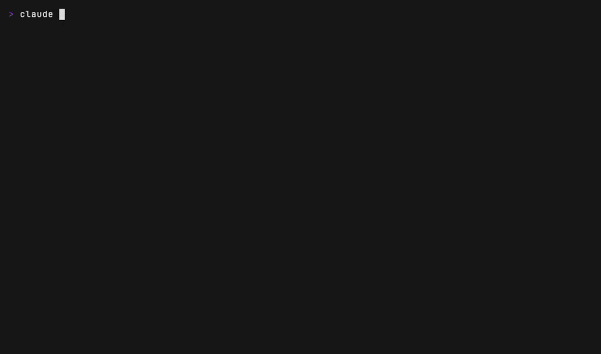

# 🧘 vibestretch

Stretch nudges in your terminal while your coding agent works.



Your agent grinds for minutes at a time. You sit there, slouched, not blinking.
That window is what ad-supported dev tools sell. vibestretch gives it back to your spine:

```
🧘 Slow neck rolls — 5 each direction. · vibestretch · 7 min of agent time
```

**It isn't a break timer.** A timer runs on a schedule and lands whenever it
lands — usually mid-thought, which is why most people end up turning them off.
vibestretch has no schedule. It counts exactly one thing: the minutes an agent
turn kept you waiting at the machine. It speaks inside that wait and nowhere
else, so a day of quick turns says nothing at all, and there is nothing to
snooze because it never interrupts you in the first place.

The nudge reaches you several ways, because you're rarely looking at the right
spot when it fires:

- a line in the session — for when you're watching the agent work
- a soft chime of its own (bundled, nothing system-sounding) — for when you're
  not looking at any screen at all
- a notification banner (Warp, Ghostty, iTerm2, WezTerm, kitty; in VS Code only
  if you add a notifier extension) — for the moment it fires; what your terminal
  does with it varies, see [How it works](#how-it-works)
- your status line, if you run [`/vibestretch:statusline`](#show-it-in-your-status-line)
  — the one channel that's still there when you come back from another app

All out of the box, nothing to configure. `VIBESTRETCH_SOUND=0` mutes the
sound, `VIBESTRETCH_NOTIFY=0` drops the banner.

Twelve exercises ship with it — stretches, micro-workouts, and eye breaks
(20-20-20 and friends) — rotating so you never get the same one twice in a row.
Swap them for [your own list](#your-own-exercises) if you'd rather.

## Install (Claude Code)

```
/plugin marketplace add Eliasjunit/vibestretch
/plugin install vibestretch@vibestretch
```

That's it. No dependencies, no daemon, no telemetry, no ads, no links in your terminal —
a few small POSIX shell scripts (plus one chime.wav) wired into Claude Code hooks.
Nothing ever leaves your machine.

## Install (Codex CLI)

Codex has no plugin marketplace, so it's a clone and a config file:

```
git clone https://github.com/Eliasjunit/vibestretch ~/.codex/vibestretch
cp ~/.codex/vibestretch/hooks/codex-hooks.json ~/.codex/hooks.json
```

Already have a `~/.codex/hooks.json`? Merge the three entries from ours into it
rather than overwriting yours. Codex asks you to trust a new hook config the
first time it runs — that prompt is expected.

What differs from Claude Code: you get the line in the session and the chime,
but no notification banner. Codex parses hook output strictly and drops the
whole object if it contains a field it doesn't know, and it has no field for a
terminal sequence — so sending one would cost you the nudge itself. There's no
status line segment either; that bar isn't scriptable in Codex.

The debt is shared across CLIs, deliberately: an hour of waiting is an hour of
waiting whichever agent kept you in the chair.

## Install (Gemini CLI)

Hooks ship enabled since Gemini CLI v0.26. Clone, then merge our three entries
into your settings:

```
git clone https://github.com/Eliasjunit/vibestretch ~/.gemini/vibestretch
```

Then copy the `hooks` object from `~/.gemini/vibestretch/hooks/gemini-hooks.json`
into `~/.gemini/settings.json`. That file is your whole Gemini configuration, so
merge rather than replace — with `jq` it's one line:

```
jq -s '.[0] * .[1]' ~/.gemini/settings.json ~/.gemini/vibestretch/hooks/gemini-hooks.json > /tmp/s.json && mv /tmp/s.json ~/.gemini/settings.json
```

As with Codex: the line in the session and the chime, no notification banner —
Gemini reserves a hook's stdout for JSON alone, so there's nowhere to print an
escape sequence. `BeforeAgent`, `AfterTool` and `AfterAgent` map exactly onto
the three moments the plugin cares about.

Both non-Claude adapters are built against the published hook contracts —
Codex's generated JSON schemas and Gemini's hooks reference — and validated
against them, but neither has been dogfooded on a live install yet. If your
build behaves differently, an issue with the output would be welcome.

## When it nudges

vibestretch counts one thing only: **agent time** — the minutes an agent turn was
in flight while you were at the machine, added up since your last nudge. That is
not how long you have been at your desk, and the counter never claims to be: an
hour of reading and typing with quick turns in between adds almost nothing. What
it measures is the time the agent kept you waiting. A nudge fires only when all
three are true:

1. The current turn has been running for a while — you're actually waiting right now
   (default: 2+ min).
2. Your accumulated agent time since the last nudge is high enough — one big task
   or several medium ones both count (default: 5+ min).
3. The last nudge wasn't recent (default: 15 min cooldown).

Step away from the keyboard for 45+ minutes and the debt resets — you already had
your break. That reset is measured against the system's input clock, not against
anything the plugin bookkeeps, so it also fires when you come back to a window
where the agent kept working on its own and you haven't typed a prompt yet.

And time when nobody touches the machine is never counted at all: on
macOS the hooks read the system keyboard/mouse idle clock, so an agent grinding
overnight adds no agent time and never chimes at an empty chair. (On Linux
there's no portable idle clock, so this guard degrades to the 45-minute reset.)
This makes vibestretch model-agnostic by construction: fast models finish
turns before thresholds hit, so there's nothing to mute.

## Configure

Environment variables, all optional (the thresholds are in seconds):

| Variable | Default | Meaning |
|---|---|---|
| `VIBESTRETCH_MIN_TURN` | `120` | Current turn must run at least this long |
| `VIBESTRETCH_MIN_ACTIVE` | `300` | Accumulated agent time since your last break |
| `VIBESTRETCH_COOLDOWN` | `900` | Minimum gap between nudges |
| `VIBESTRETCH_AWAY` | `300` | No keyboard/mouse for this long = you're away: no debt, no nudges (macOS-only detection; `0` disables the guard) |
| `VIBESTRETCH_DISABLE` | unset | Set to anything to mute nudges |
| `VIBESTRETCH_NOTIFY` | `1` | Set to `0` to drop the desktop notification |
| `VIBESTRETCH_SOUND` | `1` | Set to `0` to mute the sound |
| `VIBESTRETCH_EXERCISES` | `~/.config/vibestretch/exercises.txt` | Path to your own exercise list (not seconds — a file path) |

Running an agent headlessly (`claude -p`, `codex exec`, `gemini -p` from a
script, cron, or a bot)? Set `VIBESTRETCH_DISABLE=1` in that environment. Otherwise those unattended sessions
count as sitting time you never actually sat through, and spend the nudge you
should have gotten at your desk.

## Your own exercises

Put one exercise per line in `~/.config/vibestretch/exercises.txt` and the
built-in twelve step aside:

```
mkdir -p ~/.config/vibestretch
cat > ~/.config/vibestretch/exercises.txt <<'EOF'
# blank lines and comments are skipped
Refill the water glass. Yes, now.
Hang from the pull-up bar for 20 seconds.
Look out the window and find something green.
EOF
```

Point `VIBESTRETCH_EXERCISES` at another path if you'd rather keep the file
elsewhere (per-project lists work fine that way). The rotation covers your list
in order, so you don't get the same one twice in a row. A file that exists but
contains nothing usable falls back to the built-ins rather than nudging you with
a blank line — and quotes or backslashes in your text are safe to use.

## How it works

Three [hooks](https://docs.claude.com/en/docs/claude-code/hooks), one per moment
that matters:

| Moment | Claude Code | Codex | Gemini |
|---|---|---|---|
| the agent starts working on your prompt | `UserPromptSubmit` | `UserPromptSubmit` | `BeforeAgent` |
| a tool finished — accumulate wait, nudge if due | `PostToolUse` | `PostToolUse` | `AfterTool` |
| the turn is over — close the accounting | `Stop` | `Stop` | `AfterAgent` |

The nudge is a `systemMessage` (a brief in-session notice shown to you, never
added to the model's context) plus an optional `terminalSequence` carrying the
desktop notification. Terminals that aren't known to support the sequence get
nothing rather than stray bytes.

What your terminal then does with that sequence is its own call: some post a
real OS notification that waits in the notification center, others (Warp) draw
their own banner inside the window — which you never see if you're looking at
another app, and which is gone by the time you come back. Either way it's a
moment, not a record, so vibestretch doesn't lean on it: the chime catches you
while you're away, and the status line is what's still saying it when you
return. On macOS, terminals that post real notifications can be set to
**Alerts** (System Settings → Notifications) so the banner waits instead of
fading.

One consequence of having both channels: if your terminal plays its own sound
for notifications — iTerm2 does out of the box — a nudge arrives as two sounds,
ours and its. `VIBESTRETCH_SOUND=0` drops ours and leaves the one your terminal
already makes.

VS Code deserves its own paragraph, being a common place to keep an agent
running, and it has two surfaces that don't behave alike. In the integrated
terminal the line, the chime and the status line all work — except that Claude
Code prefixes the line with the hook that produced it (`PostToolUse:Bash says:
🧘 …`) instead of showing it on its own. In the extension's chat panel neither
the line nor the status line renders at all, so the chime is the only channel
left: you hear that it's time to move, but not what to do.

The banner is missing on both surfaces by default, and that part isn't Claude
Code's doing — VS Code has no desktop notification of its own for these
sequences and discards them without printing anything. We send it there anyway,
in the form the notifier extensions for that gap read, so installing one turns
the banner on. Tested with Terminal Notification: the nudge arrives as a toast
inside the VS Code window, and a real macOS notification additionally needs that
extension's helper to be granted permission, which macOS asks about once. With
no extension installed nothing is shown and nothing is broken. All of this was
checked on Claude Code 2.1.234.

The terminal's tab title would be the obvious place for a badge, and it isn't
available: Claude Code rewrites the title itself every turn, so anything a
plugin parks there is gone in seconds. Tried in 0.4.2, removed in 0.4.5.

State lives in `~/.cache/vibestretch/`. Exercises rotate so you don't get squats twice in a row.

`sh tests/run.sh` checks the part that matters — that the plugin never claims
time you didn't spend waiting. The system idle clock is stubbed, so "you left
for 90 minutes" is a variable and every case is deterministic.

## Show it in your status line

The in-session notice is transient by platform design, and plugins can't draw
in the status line — that bar belongs to you. So vibestretch offers the next
best thing, one command:

```
/vibestretch:statusline
```

It backs up your settings, wraps your existing status line command (or installs
a minimal one if you have none), and adds the nudge segment: the exercise for 5
minutes after each nudge, fading from bold green to dim as its time runs out,
and a quiet `🧘 12m agent time` counter whenever 2+ minutes of fresh debt have
built up. Run it again after a plugin
update to refresh the helpers; undo with `/vibestretch:statusline off`. If you
ever uninstall the plugin, run `off` first — uninstalling alone would leave the
segment configured but frozen.

Prefer wiring it yourself? The state is plain files
(`~/.cache/vibestretch/`: `current` — latest exercise text, `last-nudge` —
unix time it fired, `active` — seconds of agent time since the last nudge).
Rather than parsing
them by hand, copy `scripts/statusline-segment.sh` somewhere stable and call
it from your status line command — it handles the edge cases (empty files,
mute, staleness) that a quick snippet won't.

## Recently added

- OpenAI Codex CLI support (0.5.0)
- Gemini CLI support (0.6.0)
- Your own exercise list (0.7.0)
- The banner now reaches VS Code, where a notifier extension can show it (0.7.1)

Nothing else is planned right now — the thing does what it set out to do. If it
misses something you'd actually use, open an issue.

## Who made this

Built in public by [Junit](https://github.com/Eliasjunit) — founder building AI
products, apps and games (and trying not to fuse with the chair while the agents
grind).

MIT.
